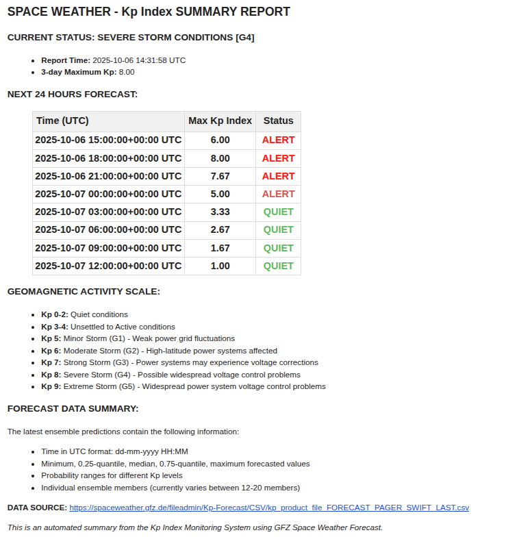

# Kp Index Space Weather Monitor

A Python-based monitoring system that tracks the Kp geomagnetic index from GFZ Potsdam and sends automated email alerts when space weather conditions exceed specified thresholds.

## Features

- **Real-time monitoring** of Kp geomagnetic index from GFZ data
- **Configurable alert thresholds** with YAML-based configuration
- **Email notifications** via local SMTP (Linux mail system)
- **Multiple operation modes**: single check, continuous monitoring, summary reports
- **Comprehensive logging** with configurable levels
- **Smart alert management** to prevent spam (6-hour cooldown between alerts)
- **HTML-formatted emails** with detailed space weather information

## Quick Start

### 1. Install Dependencies

```bash
pip install -r requirements.txt
```

### 2. Configure Settings

Copy `config.yaml.template ` to customize your monitoring setup:

`cp config.yaml.template config.yaml`

```yaml
# Alert settings
kp_alert_threshold: 5.0 # Kp value to trigger alerts (0-9 scale)
check_interval_hours: 3.0 # Hours between checks in continuous mode

# Email recipients
recipients:
  - "spaceweather@yourorg.com"
  - "alerts@yourorg.com"

# Logging configuration
log_file: "kp_index_monitor.log"
log_level: "INFO" # DEBUG, INFO, WARNING, ERROR
```

### 3. Test the System

First, test data fetching:

```bash
python -m src.kp_fetch_test.py
```

Then test email functionality:

```bash
python -m src.kp_index_monitor --test
```

### 4. Run Monitoring

**Single check:**

```bash
python -m src.kp_index_monitor --once
```

**Continuous monitoring:**

```bash
python -m src.kp_index_monitor --continuous
```

**Summary report:**

```bash
python -m src.kp_index_monitor --summary
```

## Configuration

### Configuration File

The system uses YAML configuration files for easy management. You can specify a custom config file using the `KP_MONITOR_CONFIG` environment variable:

```bash
export KP_MONITOR_CONFIG=/path/to/custom_config.yaml
python -m src.kp_index_monitor --once
```

### Configuration Options

| Parameter              | Type   | Description                | Valid Range              |
| ---------------------- | ------ | -------------------------- | ------------------------ |
| `kp_alert_threshold`   | float  | Kp value triggering alerts | 0.0 - 9.0                |
| `check_interval_hours` | float  | Hours between checks       | > 0.0                    |
| `recipients`           | list   | Email addresses for alerts | Valid email format       |
| `log_file`             | string | Path to log file           | Valid file path          |
| `log_level`            | string | Logging verbosity          | DEBUG/INFO/WARNING/ERROR |

### Example Configurations

**Research Station (High Sensitivity):**

```yaml
kp_alert_threshold: 4.0
check_interval_hours: 1.0
recipients: ["operations@station.gov"]
log_file: "kp_monitor_station.log"
log_level: "DEBUG"
```

**Power Grid Monitoring (Critical Events Only):**

```yaml
kp_alert_threshold: 6.0
check_interval_hours: 0.5
recipients: ["grid-ops@utility.com", "duty-manager@utility.com"]
log_file: "kp_monitor_grid.log"
log_level: "INFO"
```

## Operation Modes

### Single Check Mode

Run one monitoring check and exit:

```bash
python -m src.kp_index_monitor --once
```

_Perfect for cron jobs or testing_

### Continuous Monitoring Mode

Run continuously with scheduled checks:

```bash
python -m src.kp_index_monitor --continuous
```

_Ideal for dedicated monitoring servers_

### Test Mode

Test email functionality:

```bash
python -m src.kp_index_monitor --test
```

_Sends a test email to verify configuration_

### Summary Email Mode

Send current space weather summary:

```bash
python -m src.kp_index_monitor --summary
```

_Generates comprehensive status report_

## Email System Requirements

This system uses the **local Linux mail system** (localhost SMTP) to send emails. This approach is more reliable for server deployments than external SMTP.

### Setup Local Mail System

**Ubuntu/Debian:**

```bash
sudo apt-get install postfix mailutils
sudo dpkg-reconfigure postfix
```

**CentOS/RHEL:**

```bash
sudo yum install postfix mailx
sudo systemctl enable postfix
sudo systemctl start postfix
```

### Alternative: External SMTP

If you prefer external SMTP, modify the `send_alert()` method in `kp_index_monitor.py` to use your preferred SMTP server and authentication.

## Data Source and Format

### Source Information

- **Provider**: GFZ Helmholtz Centre for Geosciences
- **URL**: https://spaceweather.gfz.de/fileadmin/Kp-Forecast/CSV/kp_product_file_FORECAST_PAGER_SWIFT_LAST.csv
- **Update Frequency**: Every 3 hours (GFZ updates their forecast data)
- **Format**: CSV with ensemble forecast data

### Forecast Data Structure

The latest ensemble predictions contain the following information:

#### Time Format

- **Time (UTC)**: Forecast time in dd-mm-yyyy HH:MM format

#### Statistical Measures

- **minimum**: Minimum forecasted Kp value
- **0.25-quantile**: Value such that 25% of forecasts are below this level
- **median**: Median forecasted Kp value
- **0.75-quantile**: Value such that 75% of forecasts are below this level
- **maximum**: Maximum forecasted Kp value

#### Probability Ranges

- **prob 4-5**: Probability of 4 ≤ Kp ≤ 5
- **prob 5-6**: Probability of 5 ≤ Kp ≤ 6
- **prob 6-7**: Probability of 6 ≤ Kp ≤ 7
- **prob 7-8**: Probability of 7 ≤ Kp ≤ 8
- **prob ≥ 8**: Probability of Kp ≥ 8

#### Ensemble Members

- **Individual ensemble members**: Indexed by \_i, where i is a progressive integer number
- **Current ensemble size**: Varies between 12 and 20 members

## Alert System

### Geomagnetic Storm Classification

The Kp index scale and corresponding geomagnetic storm levels:

| Kp Range | Classification      | NOAA Scale | Impact Level                             |
| -------- | ------------------- | ---------- | ---------------------------------------- |
| Kp 0-2   | Quiet               | -          | No impact                                |
| Kp 3-4   | Unsettled to Active | -          | Minor impact                             |
| Kp 5     | Minor Storm         | G1         | Weak power grid fluctuations             |
| Kp 6     | Moderate Storm      | G2         | High-latitude power systems affected     |
| Kp 7     | Strong Storm        | G3         | Power systems voltage corrections needed |
| Kp 8     | Severe Storm        | G4         | Widespread voltage control problems      |
| Kp 9     | Extreme Storm       | G5         | Complete power system blackouts possible |

### Sample Alert Email

### Sample Summary Email

## Server Deployment

### Using Cron for Automation

Add to crontab for automatic execution:

```bash
crontab -e

# Run single check every 3 hours
0 */3 * * * cd /path/to/kp_alert && /usr/bin/python3 -m src.kp_index_monitor --once

# Daily summary at 8 AM
0 8 * * * cd /path/to/kp_alert && /usr/bin/python3 -m src.kp_index_monitor --summary
```

### As a Systemd Service

Create `/etc/systemd/system/kp-monitor.service`:

```ini
[Unit]
Description=Kp Index Space Weather Monitor
After=network.target

[Service]
Type=simple
User=kp-monitor
WorkingDirectory=/opt/kp-alert
ExecStart=/usr/bin/python3 /opt/kp-alert/src/kp_index_monitor.py --continuous
Restart=always
RestartSec=300
Environment=KP_MONITOR_CONFIG=/opt/kp-alert/config.yaml

[Install]
WantedBy=multi-user.target
```

Enable and start:

```bash
sudo systemctl enable kp-monitor
sudo systemctl start kp-monitor
sudo systemctl status kp-monitor
```

## Testing and Verification

### Initial Setup Testing

1. **Test data fetching**:

   ```bash
   python -m src.kp_fetch_test
   ```

2. **Test email functionality**:

   ```bash
   python -m src.kp_index_monitor --test
   ```

3. **Run single monitoring check**:

   ```bash
   python -m src.kp_index_monitor --once
   ```

4. **Validate configuration**:
   ```bash
   python -c "from src.config import MonitorConfig; config = MonitorConfig.from_yaml(); print('Configuration valid!')"
   ```

### Troubleshooting

#### Common Issues

1. **Email sending fails**:

   - Check if local mail system (postfix) is running: `sudo systemctl status postfix`
   - Test mail system: `echo "Test" | mail -s "Test Subject" your-email@domain.com`
   - Check mail logs: `sudo tail -f /var/log/mail.log`

2. **Data fetch fails**:

   - Check internet connectivity
   - Verify GFZ website is accessible: `curl -I https://spaceweather.gfz.de/`
   - Check logs for specific error messages

3. **Configuration errors**:

   - Validate YAML syntax: `python -c "import yaml; yaml.safe_load(open('config.yaml'))"`
   - Check file permissions: `ls -la config.yaml`
   - Verify email format in recipients list

4. **Permission errors on server**:
   - Ensure proper file permissions: `chmod 644 config.yaml`
   - Run as appropriate user
   - Check systemd service user permissions

#### Log Files

Monitor system activity:

```bash
# Watch real-time logs
tail -f kp_index_monitor.log

# Check for errors
grep ERROR kp_index_monitor.log

# View recent activity
tail -50 kp_index_monitor.log
```

### Configuration Validation

The system automatically validates configuration on startup:

- **Kp threshold**: Must be between 0-9
- **Check interval**: Must be positive
- **Email addresses**: Must be valid format
- **Log file**: Must be accessible path

Error messages will indicate specific validation failures.

## Security Considerations

- **Configuration files**: Keep `config.yaml` secure with appropriate file permissions (644 or 600)
- **Email security**: Uses local mail system to avoid storing external credentials
- **Service accounts**: Use dedicated user accounts for production deployment
- **Log management**: Monitor log files and implement log rotation
- **Network security**: Firewall rules for production servers
- **Environment variables**: Use `KP_MONITOR_CONFIG` for sensitive deployments

## Advanced Configuration

### Multiple Alert Thresholds

You can run multiple instances with different thresholds:

```bash
# High-priority alerts (severe storms only)
KP_MONITOR_CONFIG=config_critical.yaml python -m src.kp_index_monitor --continuous

# Research alerts (all activity)
KP_MONITOR_CONFIG=config_research.yaml python -m src.kp_index_monitor --continuous
```

## Development and Contribution

### Project Structure

```
kp_alert/
├── src/
│   ├── __init__.py           # Package initialization
│   ├── config.py             # Configuration management with YAML support
│   ├── kp_index_monitor.py   # Main monitoring application
│   └── kp_fetch_test.py      # Data fetching test script
├── config.yaml               # Main configuration file
├── requirements.txt          # Python dependencies
└── README.md                 # Documentation
```

### Key Features

- **YAML Configuration**: Type-safe configuration with validation
- **Robust Error Handling**: Graceful handling of network and data issues
- **Smart Alert Logic**: 6-hour cooldown to prevent alert spam
- **Local SMTP**: No external credentials required

### Contributing

- Follow PEP 8 style guidelines
- Add appropriate NumPy-style docstrings and comments
- Test changes with both single and continuous modes
- Update documentation for new features
- Validate configuration changes with the test suite

### Testing Framework

```bash
# Run all tests
python -m src.kp_fetch_test.py
python -m src.kp_index_monitor --test
python -m src.kp_index_monitor --once

# Configuration validation
python -c "from src.config import MonitorConfig; MonitorConfig.from_yaml().validate()"
```

## License and Attribution

This project is for educational and research purposes.

**Data Attribution**: Space weather data provided by GFZ Helmholtz Centre for Geosciences (https://spaceweather.gfz.de/).

## Support

For issues and questions:

1. Check the troubleshooting section
2. Review log files for error details
3. Verify configuration settings
4. Test individual components using provided test scripts
